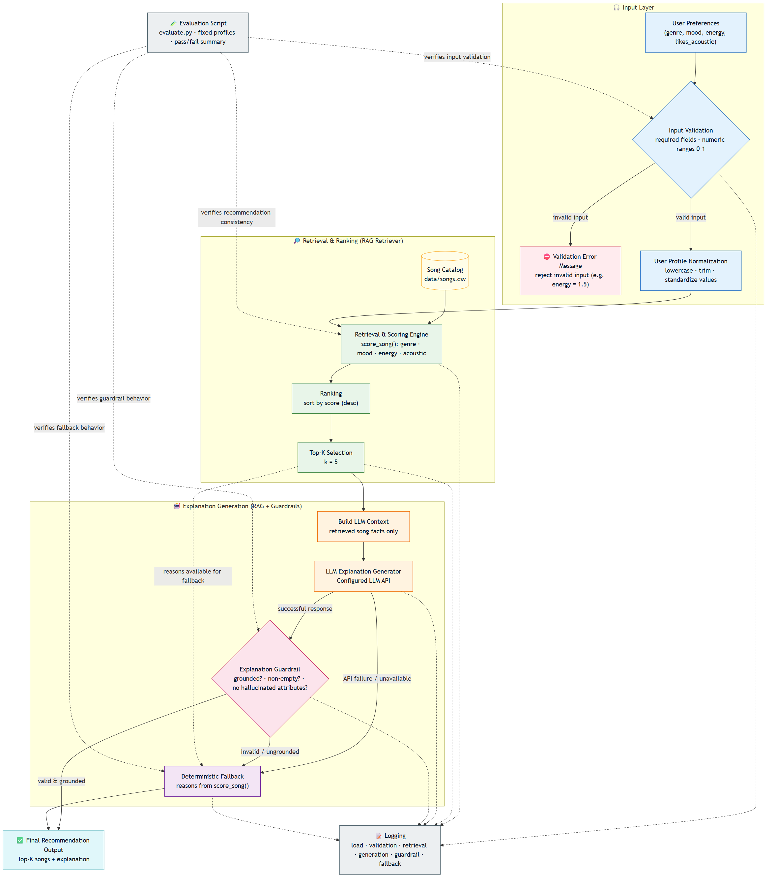

# 🎵 Applied AI Music Recommender

An AI-augmented, content-based music recommender that pairs a **deterministic recommendation engine** with a **Google Gemini explanation layer** — wrapped in validation, grounding, guardrails, and a deterministic fallback so the system stays reliable even when the LLM does not.

The system recommends songs from a curated catalog, then explains *why* each recommendation fits the listener. The explanations are the interesting part: an LLM can write warm, natural language, but it can also hallucinate. **Trustworthy explanations matter** because a confident-sounding but wrong explanation ("we picked this because it's your favorite jazz track" — when it isn't) erodes user trust faster than no explanation at all. This project treats the LLM as a component to be *verified*, not trusted: every generated explanation must be grounded in the actual retrieved songs, and anything that fails the check is transparently replaced by a deterministic explanation built from the scoring logic itself.

---

## 2. Original Project

This system extends **Project 3: Music Recommender Simulation**.

The original Project 3 was a command-line, content-based recommender that **loaded songs from a CSV catalog**, **scored each song using genre, mood, energy similarity, and acoustic preference**, and **ranked and displayed the top content-based recommendations** with a short, deterministic explanation of the points each song earned.

**Project 4** keeps that entire pipeline unchanged and builds an *Applied AI System* around it: it validates and normalizes user input, retrieves the top songs as grounded context for a Large Language Model, uses Gemini to generate friendly explanations, guards those explanations against hallucination, and falls back to the original deterministic explanations whenever the LLM is unavailable or its output fails validation. A separate evaluation harness verifies the whole chain without spending API calls.

---

## 3. New Features

Everything below is implemented and tested in this repository:

- **Input validation & normalization** (`src/validation.py`) — required fields, type checks, `target_energy` restricted to `0.0–1.0` (rejects NaN/∞ and out-of-range), genre/mood trimmed and lowercased; returns a normalized copy without mutating the input.
- **Gemini explanation generation** (`src/llm_service.py`) — uses the Google Gen AI SDK (`google-genai`), loads `GEMINI_API_KEY` from `.env`, and exposes a single `generate_explanation(context)` function.
- **Grounding** (`src/explanations.py`) — builds a plain-text context containing *only* the user's preferences and the actually-retrieved songs, so the LLM has no room to invent facts.
- **Output guardrails** (`src/guardrails.py`) — a lightweight, deterministic check that rejects empty output, over-long output (>180 words), placeholder text, quoted titles that were never retrieved (hallucination), and any explanation that fails to name the top recommendation.
- **Deterministic fallback** (`src/explanations.py`) — a grounded explanation built directly from the scoring reasons, guaranteed to be available with no API key.
- **Error handling** (`src/main.py`) — an LLM failure or a rejected explanation is caught, logged, and transparently replaced by the fallback; the run continues.
- **Automated testing** (`tests/`) — 61 pytest tests across validation, recommender, explanations, LLM service (mocked), guardrails, and CLI integration.
- **Deterministic evaluation harness** (`evaluate.py`) — 7 fixed cases that exercise the full pipeline and print a pass/fail summary **without making real Gemini calls**.

---

## 4. Architecture Overview



The editable Mermaid source is available at
[`diagrams/architecture.mmd`](diagrams/architecture.mmd).
```

**System flow in plain English:**

```
User profile
  → validation (reject bad input early)
  → recommendation scoring (genre, mood, energy, acoustic)
  → grounded context (only the retrieved songs' real facts)
  → Gemini explanation (friendly, natural language)
  → guardrail (is it grounded, non-empty, and does it name the top pick?)
  → AI explanation   (if valid)
     — or —
     deterministic fallback   (if the LLM failed or the guardrail rejected it)
```

`evaluate.py` validates this pipeline **separately and independently**. It exercises validation, scoring, grounding, the guardrail, and the fallback using fixed cases and simulated LLM behavior, so it is reproducible and **never makes a real Gemini API call**.

---

## 5. Project Structure

```
applied-ai-system-project/
├── data/
│   └── songs.csv              # 20-song catalog (the knowledge source)
├── diagrams/
│   └── architecture.mmd       # Mermaid source for the diagram above
├── src/
│   ├── main.py                # CLI runner + orchestration (generate → guardrail → fallback)
│   ├── recommender.py         # Project 3 core: load_songs, score_song, recommend_songs
│   ├── validation.py          # validate_and_normalize_profile + ValidationError
│   ├── explanations.py        # build_recommendation_context + build_fallback_explanation
│   ├── llm_service.py         # generate_explanation (Gemini) + LLMServiceError
│   └── guardrails.py          # validate_explanation (deterministic grounding check)
├── tests/
│   ├── test_recommender.py
│   ├── test_validation.py
│   ├── test_explanations.py
│   ├── test_llm_service.py    # Gemini client fully mocked
│   ├── test_guardrails.py
│   ├── test_main.py           # CLI integration, LLM mocked
│   └── test_evaluate.py
├── evaluate.py                # deterministic evaluation harness (no real API calls)
├── model_card.md              # responsible-AI model card
├── requirements.txt
├── .env.example               # template for GEMINI_API_KEY (no real key)
└── README.md
```

---

## 6. Setup (Windows PowerShell)

```powershell
git clone https://github.com/lajoni1000/applied-ai-system-project.git
cd applied-ai-system-project

python -m venv .venv
.venv\Scripts\Activate.ps1

pip install -r requirements.txt
```

Create your local `.env` from the template and add your key:

```powershell
Copy-Item .env.example .env
```

Then edit `.env` so it contains your real key:

```
GEMINI_API_KEY=your_api_key_here
```

> ⚠️ **Never commit your real API key.** `.env` is already listed in `.gitignore`; only `.env.example` (with the placeholder value) is tracked.

---

## 7. How to Run

From the project root:

```powershell
python -m src.main
```

This runs the predefined evaluation profiles, printing each profile's recommendations followed by an **AI EXPLANATION** section.

If Gemini is **unavailable** — missing/invalid API key, network error, or an explanation that fails the guardrail — the system automatically prints a short controlled notice and shows the **deterministic fallback explanation** instead. The program never crashes on an LLM failure and always produces a recommendation.

---

## 8. Sample End-to-End Interactions

> The explanation text shown below is the **deterministic fallback** — genuine, reproducible output from `build_fallback_explanation`. When a valid Gemini key/model is configured, an AI-generated explanation replaces it; the recommendations themselves are identical either way.

(.venv) PS C:\Users\hanny\OneDrive\Documentos\Foundations of AI Engineering\applied-ai-system-project> python -m src.main

============================================================
PROFILE: 1. High-energy (aligned preferences)
============================================================
Profile:
  Favorite Genre: edm
  Favorite Mood: uplifting
  Target Energy: 0.95
  Likes Acoustic: NO

  1. Voltage Rising - Pulsewave
     Score: 4.00
       - +2.0 genre match (edm)
       - +1.0 mood match (uplifting)
       - +1.00 energy match

  2. Gym Hero - Max Pulse
     Score: 0.98
       - +0.98 energy match

  3. Iron Verdict - Ashen Crown
     Score: 0.97
       - +0.97 energy match

  4. Storm Runner - Voltline
     Score: 0.96
       - +0.96 energy match

  5. Midnight Circuit - Bassline Ghost
     Score: 0.95
       - +0.95 energy match

AI EXPLANATION
------------------------------------------------------------
  Welcome! I picked these songs to match your love for high energy, non-
  acoustic tracks, led by your top recommendation, "Voltage Rising" by
  Pulsewave. It completely aligns with your preferences, delivering an
  uplifting EDM vibe with high energy and no acoustic elements.   To match
  your focus on high energy without acoustic sounds, the rest of the list
  brings non-acoustic options across pop, metal, rock, and drum and bass.
  Tracks like "Gym Hero" by Max Pulse, "Iron Verdict" by Ashen Crown, "Storm
  Runner" by Voltline, and "Midnight Circuit" by Bassline Ghost all deliver
  the high energy you are looking for!


============================================================
PROFILE: 2. Low-energy / chill (with acoustic bonus)
============================================================
Profile:
  Favorite Genre: lofi
  Favorite Mood: chill
  Target Energy: 0.35
  Likes Acoustic: YES

  1. Library Rain - Paper Lanterns
     Score: 4.50
       - +2.0 genre match (lofi)
       - +1.0 mood match (chill)
       - +1.00 energy match
       - +0.5 acoustic bonus

  2. Midnight Coding - LoRoom
     Score: 4.43
       - +2.0 genre match (lofi)
       - +1.0 mood match (chill)
       - +0.93 energy match
       - +0.5 acoustic bonus

  3. Focus Flow - LoRoom
     Score: 3.45
       - +2.0 genre match (lofi)
       - +0.95 energy match
       - +0.5 acoustic bonus

  4. Spacewalk Thoughts - Orbit Bloom
     Score: 2.43
       - +1.0 mood match (chill)
       - +0.93 energy match
       - +0.5 acoustic bonus

  5. Coffee Shop Stories - Slow Stereo
     Score: 1.48
       - +0.98 energy match
       - +0.5 acoustic bonus

AI EXPLANATION
------------------------------------------------------------
  Hello there! These song recommendations are a wonderful fit for your
  taste. Our top recommendation, "Library Rain" by Paper Lanterns, is an
  ideal match because it brings together your favorite lofi genre, a chill
  mood, acoustic warmth, and your exact target energy level.   The rest of
  the playlist keeps those great vibes going! Tracks like "Midnight Coding"
  and "Focus Flow" by LoRoom give you more of the lofi sound and acoustic
  feel you love. Meanwhile, "Spacewalk Thoughts" by Orbit Bloom and "Coffee
  Shop Stories" by Slow Stereo complement your list with acoustic touches,
  offering additional chill, ambient, relaxed, and jazz styles to enjoy.


============================================================
PROFILE: 3. Different genre and mood (r&b / romantic)
============================================================
Profile:
  Favorite Genre: r&b
  Favorite Mood: romantic
  Target Energy: 0.48
  Likes Acoustic: NO

  1. Velvet Hours - Silk Avenue
     Score: 4.00
       - +2.0 genre match (r&b)
       - +1.0 mood match (romantic)
       - +1.00 energy match

  2. Dust and Diesel - Red Clay Road
     Score: 0.96
       - +0.96 energy match

  3. Midnight Coding - LoRoom
     Score: 0.94
       - +0.94 energy match

  4. Focus Flow - LoRoom
     Score: 0.92
       - +0.92 energy match

  5. Island Time - Palm Riddim
     Score: 0.92
       - +0.92 energy match

AI EXPLANATION
------------------------------------------------------------
  Hello there! I’ve put together a playlist tailored just for you. Your top
  recommendation, "Velvet Hours", is an absolute match for your taste. It
  brings you the smooth R&B genre and romantic mood you adore, perfectly
  captured in a non-acoustic track that hits your ideal energy level.   The
  remaining selections, including "Dust and Diesel", "Midnight Coding",
  "Focus Flow", and "Island Time", all share a very similar energy level to
  keep your queue balanced. They offer a touch of variety across country,
  lofi, and reggae genres, blending sad, chill, focused, and playful moods
  with both acoustic and non-acoustic sounds. I hope you love this mix!


============================================================
PROFILE: 4a. ADVERSARIAL: conflicting genre vs mood (metal / happy)
============================================================
Profile:
  Favorite Genre: metal
  Favorite Mood: happy
  Target Energy: 0.9
  Likes Acoustic: NO

  1. Iron Verdict - Ashen Crown
     Score: 2.92
       - +2.0 genre match (metal)
       - +0.92 energy match

  2. Sunrise City - Neon Echo
     Score: 1.92
       - +1.0 mood match (happy)
       - +0.92 energy match

  3. Rooftop Lights - Indigo Parade
     Score: 1.86
       - +1.0 mood match (happy)
       - +0.86 energy match

  4. Midnight Circuit - Bassline Ghost
     Score: 1.00
       - +1.00 energy match

  5. Storm Runner - Voltline
     Score: 0.99
       - +0.99 energy match

AI EXPLANATION
------------------------------------------------------------
  "Iron Verdict" takes the top spot for you because it delivers the non-
  acoustic metal sound you love with high energy. To match your preference
  for happy moods while keeping things energetic and strictly non-acoustic,
  we also included tracks like "Sunrise City" and "Rooftop Lights" to bring
  bright, happy vibes to your playlist. For even more high-energy, non-
  acoustic options, "Midnight Circuit" and "Storm Runner" round out the list
  with drum and bass and rock styles. Altogether, these songs highlight your
  favorite metal genre, non-acoustic instrumentation, lively energy, and
  cheerful moods!


============================================================
PROFILE: 4b. EDGE CASE: out-of-range target_energy (1.5)
============================================================
validation failed: target_energy must be between 0.0 and 1.0, got 1.5
  [SKIPPED] Invalid profile: target_energy must be between 0.0 and 1.0, got 1.5

---

## 9. Reliability and Guardrail Behavior

These behaviors are reproducible and covered by the evaluation harness (`python evaluate.py`).

### A. Invalid input — `target_energy = 1.5`

Validation runs **before** any Gemini call, so an out-of-range energy is rejected up front:

```
[SKIPPED] Invalid profile: target_energy must be between 0.0 and 1.0, got 1.5
```

The profile is skipped, the LLM is never invoked for it, and the run continues.

### B. Hallucinated title — `"Imaginary Anthem"`

If a generated explanation names a quoted song that was **not** among the retrieved recommendations, the guardrail rejects it. From the evaluation harness:

```
[PASS] Guardrail rejects hallucinated title
       expected: guardrail rejects a hallucinated quoted title
       actual:   is_valid=False; issues=["mentions a song not in the recommendations: 'Imaginary Anthem'"]
```

The rejected text is discarded and the deterministic fallback is shown instead.

### C. Simulated Gemini outage

When the LLM raises an error, the system catches it and uses the deterministic fallback. From the evaluation harness:

```
[PASS] Simulated LLM failure -> fallback
       expected: LLM outage -> valid deterministic fallback is used
       actual:   source=fallback; fallback_non_empty=True; guardrail_valid=True
```

---

## 10. Testing

Run the unit/integration tests:

```powershell
python -m pytest -v
```

Run the deterministic evaluation harness:

```powershell
python evaluate.py
```

**Verified results:**

```
61 passed
```

```
Evaluation Summary
Passed: 7
Failed: 0
Score: 7/7 (100.0%)
```

**What the tests cover:**

- `test_recommender.py` — the Project 3 scoring/ranking behavior.
- `test_validation.py` — required fields, type checks, energy range (including NaN/∞ and boundaries), normalization, and input immutability.
- `test_explanations.py` — the grounded context and the deterministic fallback (including that they never leak un-retrieved songs and never mutate inputs).
- `test_llm_service.py` — the Gemini wrapper with the client **fully mocked**: empty context, missing key, success, empty/whitespace/`None` responses, and SDK-exception conversion.
- `test_guardrails.py` — empty, too-long, placeholder, hallucinated-title, missing-top-title, and case-insensitive matching.
- `test_main.py` — CLI integration with the LLM mocked: valid AI output shown, rejected output → fallback, LLM error → fallback, invalid profiles skipped before any Gemini call.
- `test_evaluate.py` — all cases pass, correct summary counts, exit codes 0/1, and that **no Gemini call is made**.

---

## 11. Design Decisions and Trade-offs

- **Deterministic recommender + LLM explanation layer.** Recommendations come from transparent, reproducible scoring. The LLM only writes the *explanation* — it never changes *what* is recommended. This keeps the core auditable while still gaining natural language.
- **Grounding on retrieved recommendations only.** The LLM sees just the user's preferences and the actually-retrieved songs. It cannot cite tracks that were never selected, which sharply limits hallucination.
- **Deterministic fallback favors reliability.** The system is designed to *always* return an explanation. If anything about the LLM path fails, the deterministic explanation — built from the same scoring reasons — takes over. Availability beats eloquence.
- **Lightweight, title-based guardrail.** The guardrail is cheap and deterministic (word count, placeholders, quoted-title matching, top-title mention). It is not semantic fact-checking, but it reliably catches the most damaging failure — inventing songs — without extra API cost or nondeterminism.
- **Manually curated dataset.** A small, hand-built 20-song CSV keeps the project reproducible and easy to reason about; every recommendation can be traced back to concrete rows.
- **Evaluation avoids real API calls.** `evaluate.py` simulates LLM success/failure deterministically, so it runs for free, offline, and identically every time — a reliability tool, not a billing surprise.

---

## 12. Limitations and Future Improvements

**Limitations**

- **Small dataset** — only 20 songs, so some genre/mood combinations have few matches.
- **Fixed scoring weights** — genre is weighted highest and cannot be tuned per user.
- **No collaborative filtering** — it cannot learn from what similar listeners enjoy.
- **No user history** — each request is independent; there's no personalization over time.
- **Title-based guardrail only** — it checks grounding structurally, not the semantic truth of every claim.
- **Gemini availability / rate limits** — live AI explanations depend on the API being reachable and within quota.

**Future work**

- A **larger, richer dataset** with more songs and features.
- **Stronger semantic guardrails** that verify claims against song attributes, not just titles.
- **Recommendation diversity** so results aren't near-duplicates of one another.
- A **UI or web app** front end (a Streamlit dependency is already available).
- A **broader evaluation dataset** with more profiles and adversarial cases.

---

## 13. Project Reflection

*(A fuller reflection lives in [`model_card.md`](model_card.md).)*

The core lesson of this project is that **AI reliability comes mostly from the deterministic engineering around the model**, not from the model itself. Validation stops bad input before it ever reaches the LLM; grounding constrains what the model can say; the guardrail verifies the output instead of trusting it; and the deterministic fallback guarantees the system still works when the model doesn't. Together these turn an unpredictable component into a dependable feature.

---

## What This Project Says About Me as an AI Engineer

I build **end-to-end AI systems**, not just prompts. In this project I took a deterministic recommender and layered an LLM onto it responsibly — designing the data flow, the failure paths, and the tests together rather than as an afterthought. I care about **verifying AI output instead of trusting it blindly**: every generated explanation has to prove it's grounded in real data before a user sees it, and anything that can't is replaced automatically. I deliberately **test failure conditions** — invalid input, hallucinated titles, and full LLM outages — because a system's reliability is defined by how it behaves when things go wrong. Most of all, I'm comfortable **balancing AI capability with deterministic safeguards**, using the model where it genuinely helps (natural-language explanation) while keeping the trustworthy core reproducible, auditable, and always available.
